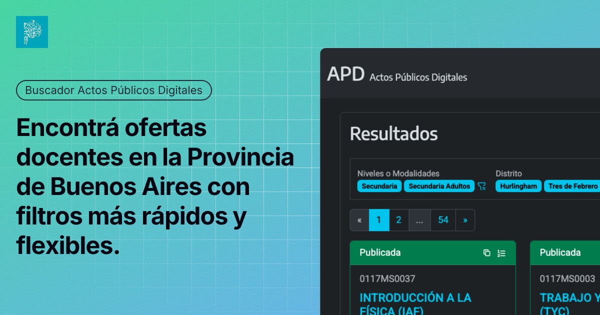

# Buscador Actos Públicos Digitales

Después de escuchar a muchos amigos docentes, decidí crear una alternativa para realizar búsquedas en los actos públicos de la Provincia de Buenos Aires.

Este proyecto busca mejorar la experiencia del buscador oficial, incorporando funcionalidades que lo hacen más flexible, rápido y fácil de usar en el día a día.

Es un proyecto open source, hecho con la intención de facilitar el acceso a la información y simplificar las búsquedas para los docentes bonaerenses.

## Fuente

El buscador está basado en los datos del sitio oficial: http://servicios.abc.gov.ar/actos.publicos.digitales/ 

## Características principales

- Interfaz simple y cómoda, pensada para uso diario
- Modo claro y oscuro
- Diseño responsive, optimizado para celulares
- Filtros avanzados:
  - combinar múltiples opciones (OR)
  - excluir opciones (NOT)
- Resultados ordenados por última modificacion (no por fecha de cierre como en el original)
- Persistencia de filtros: el buscador recuerda tus últimas selecciones
- Búsquedas compartibles mediante URL
- Resultados más limpios: solo se muestra información relevante

## Objetivo

Hacer que encontrar ofertas docentes sea más rápido, claro y eficiente, mejorando la experiencia del buscador tradicional sin reemplazarlo.

## Disclaimer

Este proyecto no es oficial ni está afiliado con el Gobierno de la Provincia de Buenos Aires.

Los datos provienen de fuentes públicas oficiales.

## Screenshots

Formulario de búsqueda con multiples filtros y exceptiones

|Claro|Oscuro|
|---|---|
|||

Resultados ordenados por última actualización (no por fecha de cierre como en el buscador original)

|Claro|Oscuro|
|---|---|
|||

## Contribuciones

Las contribuciones son bienvenidas.
Si tenés ideas, mejoras o encontraste algún problema, podés abrir un issue o pull request.
